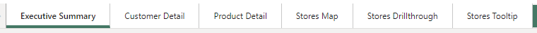

# Quarterly Business Intelligence Report with Power BI

## Project Overview
This project aims to elevate the business intelligence practices of a medium-sized international retailer by transforming their extensive sales data into actionable insights. Leveraging Microsoft Power BI, we design a comprehensive quarterly report that aids in informed decision-making at various levels of the organization.

<!--Include GIF to show how report works-->


<!--Image of all the report pages in 1 image (paint)-->


### Objectives
- **Data Consolidation**: Extract and transform data from multiple sources to create a unified dataset.
- **Data Modeling**: Implement a robust star-schema data model to facilitate insightful analysis.
- **Report Design**: Develop a multi-page Power BI report that includes:
  - A high-level business summary for C-suite executives.
  - Customer segmentation by sales region to identify high-value customers.
  - Analysis of top-performing products by category against sales targets.
  - A map visual highlighting retail outlet performance across territories.


## Phase 1: Data Loading and Preparation

### Overview
The initial phase focuses on setting up the environment, connecting to various data sources, and preparing the dataset for analysis. This includes:

### Data Connection & Extraction
1. **Orders Data (Fact Table):** Azure SQL Database
   - Contains information about each order, including the order and shipping dates, the customer, store and product IDs for associating with dimension tables, and the amount of each product ordered. 
   - Each order in this table consists of an order of a single product type, so there is only one product code per order.

2. **Products Data:** Import CSV file
   - Contains information about each product sold by the company, including the product code, name, category, cost price, sale price, and weight.

3. **Stores Data:** Azure Blob Storage
   - Contains information about the location of the stores

4. **Customers Data:** Import CSV files from folder
   - Contains information about the customers personal data and purchase history

### Data Preparation
The following transformation were made in order to ensure data integrity and consistency across all dataset.

- Dropping data sensitive columns
- Renaming columns to fit Power BI conventions.
- Splitting columns
- Dropping duplicates
- Removing irrelevant columns
- Splitting date-time details


> Note: All changes were made whilst in the `Table View` > `Transform Data` and by making use of the `Data Preview` features under the `View` tab. This project also assume you have **on-object formatting** enabled on Power BI Desktop app. To enable it, follow these steps: **File > Options and Settings > Options > Preview Features > On-object interaction** and make sure the checkbox is ticked.


## Phase 2: Data Modeling


### Introduction to Date Table and Time Intelligence

In our dataset, the absence of a dedicated Date table limits our ability to leverage Power BI's time intelligence capabilities fully. A continuous Date table, spanning the entire timeframe of our data, is crucial for enabling these functions. The Date table is fundamental for time-based analysis, allowing us to perform operations like year-over-year comparisons, calculating running totals, and more. 

#### Creating a Continuous Date Table
To address this, we've implemented a continuous Date table using DAX, covering from the earliest `Order Date` to the latest `Shipping Date`. This enables a broad range of time intelligence functions in Power BI.
   ```sh
   Dates = CALENDAR(MIN(Orders[Order Date]), MAX(Orders[Shipping Date]))
   ```
**Enriching the Date Table for Comprehensive Analysis**
The Date table has been enriched with several columns to support comprehensive time intelligence markers.

<!-- <details>
  <summary>DAX Queries for Date Table Columns</summary> -->

   - **Day of Week**
      ```sh
      DayOfWeek = WEEKDAY(Dates[Date]-1)
      ``` 
   - **Month Number**
      ```sh
      Month Number = MONTH(Dates[Date])
      ``` 
   - **Month Name**
      ```sh
      Month Name = FORMAT(Dates[Date], "MMMM")
      ``` 
   - **Quarter** 
      ```sh
      Quarter = QUARTER(Dates[Date])
      ``` 
   - **Year**
      ```sh
      Year = YEAR(Dates[Date])
      ``` 
   - **Start of Period (Year, Quarter, Month, Week)**
      ```sh
      StartOfYear = STARTOFYEAR(Dates[Date])
      StartOfQuarter = STARTOFQUARTER(Dates[Date])
      StartOfMonth = STARTOFMONTH(Dates[Date])
      StartOfWeek = Dates[Date] - WEEKDAY(Dates[Date],2) + 1
      ```
<!-- </details> -->

### Star Schema Development
The adoption of a star schema in this project is strategic, enhancing our data model's analytical capabilities. This schema simplifies complex data relationships, making it easier to perform queries and generate insightful analyses and visualizations. By centralizing the data around a single fact table (Orders) and connecting it to related dimension tables (Products, Stores, Customers, Dates), we can efficiently query the model and produce meaningful reports.

#### Schema Relationships
- **Products[Product Code]** ↔ **Orders[Product Code]**
- **Stores[Store Code]** ↔ **Orders[Store Code]**
- **Customers[User UUID]** ↔ **Orders[User UUID]**
- **Dates[Date]** ↔ **Orders[Order Date]** (active relationship)
- **Dates[Date]** ↔ **Orders[Shipping Date]** (inactive)


> Note: All relationships were established in the `Model View` by linking primary and foreign keys between the dimension tables and the fact table.


## Phase 3: DAX Measures and Analysis

### Establishing a Measures Table
Introducing a dedicated Measures Table has significantly enhanced the manageability and clarity of our data model. This centralized table, constructed using DAX and aggregating values from other tables, is essential for efficient data analysis within Power BI.

- **Creation of the Measures Table:**
  - Utilized the Power Query Editor for its setup, providing an intuitive interface for debugging.
  - Through the Model View, "Enter Data" was selected to initiate a new table specifically designated for measures.

### Comprehensive DAX Measures for In-depth Reporting
We have developed a robust set of DAX measures that are foundational for our reporting needs. These measures range from simple counts such as total orders to complex calculations for year-to-date (YTD) analytics.

**Key Measures Include:**
- **Total Orders**: Counts the number of orders by evaluating the Orders table's Order Date column.
- **Total Revenue & Profit**: Computes revenue and profit by correlating product quantities and prices between the Orders and Products tables.
- **Total Customers**: Identifies unique customers within the Orders dataset.
- **Profit YTD & Revenue YTD**: Analyzes profitability and revenue over the current fiscal year.
- **Advanced Measures**: Features like **Revenue per Customer**, **Top Customer Analysis**, and **Quarterly Targets** elevate the project's analytical depth.

<!-- <details>
  <summary>DAX Queries Measures</summary> -->

   - **Total Orders**: 
      ```sh
      Total Orders = COUNT(Orders[Order Date])
      ```
   - **Total Revenue**: 
      ```sh
      Total Revenue = SUMX(Orders, Orders[Product Quantity] * RELATED(Products[Sale Price]))
      ```
   - **Total Profit**: 
      ```sh
      Total Profit = SUMX(Orders, (RELATED(Products[Sale Price]) - RELATED(Products[Cost Price])) * Orders[Product Quantity])
      ```
   - **Total Customers**: Counts unique customers in the `Orders` table.
      ```sh
      Total Custoemrs = DISTINCTCOUNT(Orders[User UUID])
      ```
   - **Total Quantity**: Counts the items sold.
      ```sh
      Total Quantity = SUM(Orders[Product Quantity])
      ```
   - **Profit YTD**: Calculate the year-to-date profit.
      ```sh
      Profit YTD = TOTALYTD([Total Profit], Dates[Date])
      ```
   - **Revenue YTD**: Calculate the year-to-date revenue.
      ```sh
      Revenue YTD = TOTALYTD([Total Revenue], Dates[Date])
      ```
   - **Revenue per Customer**:
      ```sh
      Revenue per Customer = [Total Revenue] / [Total Customers]
      ```
   - **Top Customer**:
      ```sh
      Top Customer = MAXX(
         TOPN(1, ALL(Customers), [Total Revenue]),
         Customers[Full Name]
      )
      ```

   - **Top Customer Total Orders**:
      ```sh
      Top Customer Total Orders = CALCULATE(
         [Total Orders],
         FILTER(
            ALL(Customers),
            Customers[Full Name] = [Top Customer]
         )
      )
      ```

   - **Top Customer Total Revenue**:
      ```sh
      Top Customer Total Revenue = CALCULATE(
         [Total Revenue],
         FILTER(
            ALL(Customers),
            Customers[Full Name] = [Top Customer]
         )
      )
      ```
   **KPI**:  Used on [Executive Summary Page](#executive-summary-page) of report
   - **Previous Quarter Orders, Profit and Revenue**:

      ```sh
      Previous Quarter Orders = CALCULATE(
         TOTALQTD([Total Orders], DATEADD(Dates[Date], -1, QUARTER))
      )
      
      Previous Quarter Revenue = CALCULATE(
         TOTALQTD([Total Revenue], DATEADD(Dates[Date], -1, QUARTER))
      )

      Previous Quarter Revenue = CALCULATE(
         TOTALQTD([Total Revenue], DATEADD(Dates[Date], -1, QUARTER))
      )
      ```
      > Note: The calculation for previous quarter involves shifting the date context back by one quarter using `DATEADD` and then calculating the quarter-to-date total with `TOTALQTD`. This approach is necessary because `PREVIOUSQUARTER()` cannot find the current date in the Dates table, leading to blank values when data for the previous quarter in 2024 is attempted to be calculated with a table ending in June 2023. `DATEADD` with `TOTALQTD` offers flexibility by working from the latest available date, allowing for calculations even when the Dates table does not cover the current quarter, unlike `PREVIOUSQUARTER` which requires a complete date table up to the current date.

   - **Targets**: Set to 5% growth compared to the previous quarter
      ```sh
      Target Profit = [Previous Quarter Profit] * 1.05
      Target Revenue = [Previous Quarter Revenue] * 1.05
      Target Orders = [Previous Quarter Orders] * 1.05
      ```

   **Quartely Targets**: Used on [Customer Detail Page](#customer-detail-page) of report

   - **Total Orders, Profit and Revenue QTD**:
      ```sh
      Total Orders QTD = TOTALQTD(
         [Total Orders],
         Dates[Date]
      )

      Total Profit QTD = TOTALQTD(
         [Total Profit],
         Dates[Date]
      )

      Total Revenue QTD = TOTALQTD(
         [Total Revenue],
         Dates[Date]
      )
      ```

   - **Current Targets**: The CEO stated that they are targeting 10% quarter-on-quarter growth in all three metrics.
      ```sh
      Current Target Profit = [Previous Quarter Profit] * 1.1
      Current Target Revenue = [Previous Quarter Revenue] * 1.1
      Current Target Orders = [Previous Quarter Orders] * 1.1
      ```

   **Profit per Order**: Used on [Product Detail Page](#product-detail-page) of report.
   ```sh
   Profit per Order = [Total Profit] / [Total Orders]
   ```

   **Selection Cards**: Used on [Stores Drillthrough Page](#stores-drill-through) of report.
   ```sh
   Category Selection = IF(ISFILTERED(Products[Category]), SELECTEDVALUE(Products[Category]), "No Selection")

   Country Selection = IF(ISFILTERED(Stores[Country]), SELECTEDVALUE(Stores[Country]), "No Selection")
   ```

   - **Guage**:
      ```sh
      Profit YTD Previous Year = CALCULATE(
         [Profit YTD],
         SAMEPERIODLASTYEAR(Dates[Date])
      )

      Revenue YTD Previous Year = CALCULATE(
         [Revenue YTD],
         SAMEPERIODLASTYEAR(Dates[Date])
      )
      ```
   - **Profit and Revenue Goal**: Set to be 20%
      ```sh
      Profit Goal = [Profit YTD Previous Year] * 1.20
      Revenue Goal = [Revenue YTD Previous Year] * 1.20
      ```
 
<!-- </details> -->

Note: All implementations were made whilst in the `Model View`

### Analytical Hierarchies & Data Model Enhancement

This enhancement introduces Date and Geography hierarchies, significantly deepening the analysis capabilities of our reports. By implementing these hierarchies, users can perform granular analysis and filter data more effectively.

#### Date Hierarchy
The Date Hierarchy enables detailed drill-down in line charts and reports, organized into the following levels:
- Start of Year
- Start of Quarter
- Start of Month
- Start of Week
- Date

This structure facilitates in-depth temporal analysis, allowing users to navigate through data from a broad annual overview down to specific dates.

#### Geography Hierarchy
The Geography Hierarchy enhances data filtering and mapping precision across different geographical levels:
- World Region
- Country
- Country Region

Additionally, we've included calculated columns to improve geographical data analysis:
- **Country Column**: Maps country codes to full country names in the Stores table, enhancing clarity. The mapping follows this scheme:
  - GB: United Kingdom
  - US: United States
  - DE: Germany

   ```sh
  Country = SWITCH([Country Code], "GB", "United Kingdom", "US", "United States", "DE", "Germany")
   ```
- **Geography Column**: Combines country regions and countries into a full geography name for each row, facilitating accurate mapping.
   ```sh
   Geography = CONCATENATE(Stores[Country Region], CONCATENATE(", ", Stores[Country]))
   ```

- **Data Categories for Geographical Analysis**
To ensure precise geographical analysis and mapping, assign the following data categories to respective columns:
   - World Region as Continent
   - Country as Country
   - Country Region as State or Province

These assignments are critical for leveraging BI tools' built-in mapping capabilities, ensuring that our geographical data is represented as accurately as possible.

#### Maximizing Impact

The introduction of Date and Geography hierarchies, along with carefully crafted calculated columns, significantly enhances the analytical capabilities of your data model. These enhancements facilitate:
- **Deeper Insights:** By drilling down into specific time frames and geographical locations, users can uncover insights that were previously difficult to access.
- **Improved Decision Making:** With more granular data at their fingertips, decision-makers can craft strategies that are better informed and more precisely targeted.
- **Enhanced Data Visualization:** Accurate mapping and temporal analysis lead to clearer, more impactful visualizations, making it easier to communicate findings across the organization.


This phase underlines a pivotal advancement in crafting a dynamic business intelligence solution. It lays down a robust foundation for insightful analytics, paving the way for the next stages of visual enhancement and data optimization.


## Overview of Report Pages

This section delves into the specifics of each page within our Power BI report. Each page is meticulously designed to cater to various analytical needs, from high-level executive summaries to detailed customer insights. For every report page, we provide an overview, visual setup explanations, and insights into the cross-filtering and highlighting features that interconnect the data visualizations, enhancing the report's interactivity and analytical depth.


### Executive Summary Page

The Executive Summary page is the cornerstone of the Power BI report, offering a high-level view of the company's overall performance. It is designed to present key metrics succinctly, enabling C-suite executives to quickly glean insights and assess outcomes against targets.

#### Overview


<!-- #### Image/GIF Suggestions:
- Cards setup: An image or GIF showing the process of arranging card visuals for key financial metrics.
- Line graph evolution: A GIF demonstrating how to modify a line graph from tracking customer details to showcasing Total Revenue over time.
- KPI progression: Visuals highlighting the steps of setting up KPIs for quarterly financial targets. -->

#### Graphs

Each visual element on the page is carefully constructed using MEASURES data to ensure accuracy and relevance:

- **Card Visuals**: Highlight the company's Total Revenue, Total Profit, and Total Orders, with formatting adjusted to present data concisely.
- **Revenue Line Chart**: Displays revenue trends over time, offering an interactive view of financial performance across different periods.
- **Donut Charts**: Illustrate revenue distribution by country and store type, providing a geographical and categorical breakdown of earnings.
- **Bar Chart**: Shows the number of orders by product category, revealing product performance and customer preferences.
- **KPI Cards**: Reflect quarterly targets and achievements in revenue, orders, and profit, signifying progress towards strategic goals.

#### Cross Filtering and Highlighting Adjustments
   - `Product Category Bar Chart` and `Top 10 Products Table` does not filter the `Card` visuals or `KPIs`

> Note: This was achieved by using the `Edit Interactions` view in the `Format` tab of the ribbon.

<!-- <details>
<summary>### Detailed PowerBI Graph Setup</summary> -->

#### Constructing Card Visuals for Key Metrics
- **Steps**: Duplicate card visuals from another page and assign MEASURES for Total Revenue, Total Profit, and Total Orders. Adjust decimal places for precision in presentation.

#### Line Chart for Revenue Trends
- **Customization**: Modify the X axis to display Date Hierarchy levels and set the Y axis to Total Revenue. Position the chart to allow for easy viewing of temporal trends.

#### Donut and Bar Chart Configuration
- **Process**: Copy similar charts from other pages for efficiency. Adjust filters and axis fields to represent the correct data, ensuring that the visual reflects Total Revenue by Store[Country] and Store[Store Type], and orders by product category.

#### Setting Up KPIs for Quarterly Financials
- **Creation**: Develop new measures for previous quarter profit, revenue, and orders. Construct KPI visuals that compare current performance against these historical metrics, formatted for clarity and immediate comprehension.
- In the Format pane, set the Trend Axis to On, expand the associated tab, and set the values as follows:
   - Direction : High is Good
   - Bad Colour : Red
   - Transparency : 15%

#### Top 10 Products Table
- **Filtering**: Apply a TopN filter to the description column using Total Revenue as the value field, showcasing the products driving the most revenue.

<!-- </details> -->

### Customer Detail Page

This page focuses on analyzing customer behavior and segmentation. It includes detailed metrics on customer value, purchase patterns, and segmentation analyses to inform targeted marketing strategies.

#### Overview
The page is segmented into various visuals including card visuals for distinct metrics, line charts for temporal analysis, detailed tables for top customers, and charts for demographic segmentation. Each element is crafted to provide insights into customer behavior and value.


<!-- #### Image/GIF Suggestions:
- Cards setup: Show an image or GIF of setting up card visuals for total distinct customers and revenue per customer.
- Line chart setup: A GIF could illustrate the process of adding a line chart for weekly distinct customers, including drilling down capabilities and forecast addition.
- Table for top customers: An image showcasing the table layout with conditional formatting applied to the revenue column. -->

#### Graphs

Each visual on the Customer Detail Page leverages calculated MEASURES to present comprehensive data on customer interactions:

1. **Card Visuals** display key metrics like total distinct customers and revenue per customer, emphasizing customer base size and value.
   
2. **Line Chart** offers a timeline view of customer engagement, using MEASURES to track weekly distinct customer trends and forecast future patterns. There is also a **Drilldown** feature that allow users to go to Month level.

3. **Donut and Bar Charts** segment customers by country and product category, respectively, providing a demographic and interest-based breakdown.

4. **Customer Table** ranks the top 20 customers by revenue.

5. **Top Customer Cards** highlight the highest revenue-generating customer, focusing on their order frequency and total contribution.

#### Cross Filtering and Highlighting Adjustments
   - `Top 20 Customers table` does not filter any of the other visuals 
   - `Total Customers by Product Donut Chart` does not affect the `Customers Line Graph` 
   - `Total Customers by Country Donut Chart` does cross-filter `Total Customers by Product Donut Chart`

<!-- <details>
<summary>### Detailed Graph Setup in PowerBI</summary> -->

#### Line Chart with Forecasts
- **Activation**: With the line chart selected, access the `Analytics` pane, add a forecast to predict future customer engagement.
- **Configuration**: 
   - Add a trend line, and a forecast for the next 10 periods with a 95% confidence interval. 
   - Use the `Date Hierarchy` created previously for the X axis which allow users to `drill down` to the month level, but not to weeks or individual dates.

#### Top N Customers Table
- **Filter Application**: Use the TopN filter to display only the highest revenue-generating customers, ensuring the data presented reflects significant contributors to business success.

#### Customer Table Conditional Formatting
- **Implementation**: Apply data bars for visual enhancement of revenue values within the customer table, making it easier to compare contributions at a glance.
- Report View > Build a Visual > Column Name > Right Click > Condigitonal Formating > Data bars

#### Slicer Configuration
- **Date Slicer**: Add a date slicer for period-specific data filtering, enhancing report dynamism and user-driven analysis.
- Slicer > Field  (Year) 
- Format > Slicer Settings > Select (Between)

<!-- </details> -->

### Product Detail Page

The Product Detail Page provides an in-depth look at product performance within the inventory, combining data from all products and regions. It's designed to help the product team identify top-performing products and areas for improvement, supported by the capability to filter by product and region.

Aimed at understanding product performance, this page breaks down sales by product categories, performance against targets, and inventory levels, offering insights into product strategy and optimization.


#### Overview
This page is equipped with a variety of visuals, including gauges, area charts, and scatter graphs, each leveraging the power of MEASURES data to offer detailed insights. Here, we also incorporate cross-filtering capabilities and slicer states to refine data analysis further.

<!-- #### Image/GIF Suggestions:
- Gauges setup: An image or GIF to demonstrate the setup of gauges displaying current-quarter performance.
- Area chart progression: A GIF illustrating the creation of an area chart showing revenue performance over time.
- Scatter graph creation: Visual steps showing how to set up a scatter graph to analyze the profitability and sales quantity of each product. -->

#### Graphs

Each graph on this page is a visual representation of calculated MEASURES, providing a quantitative analysis of product performance:

- **Gauge Visuals**: Reflect the current-quarter performance of Orders, Revenue, and Profit against the CEO's 10% quarter-on-quarter growth target.
- **Area Chart**: Displays the relative revenue performance of each product category over time, highlighting trends and seasonal impacts on sales.
- **Top 10 Products Table**: Lists products by revenue in the selected context, offering a leaderboard of top-performing items.
- **Scatter Graph**: Combines quantity ordered against profit per item, helping identify products that strike the best balance between popularity and profitability.

#### Cross Filtering and Highlighting Adjustments
   - `Orders vs. Profitability Scatter Graph` does not affect any other visuals 
   - `Top 10 Products Table` does not affect any other visuals

<!-- <details>
<summary>### Detailed PowerBI Graph Setup</summary> -->

#### Gauge Visuals for Quarterly Metrics
- **Steps**: Add a set of three gauges, showing the current-quarter performance of Orders, Revenue and Profit against a quarterly target. The CEO has told you that they are targeting 10% quarter-on-quarter growth in all three metrics.
- **Conditional Formatting**: Apply conditional formatting to the callout value (the number in the middle of the gauge), so that it shows as red if the target is not yet met, and black otherwise.
   - Report View > Format > Callout value > Values > Fx > set conditional format

#### Cards to Display Filter State
- **Configuration**: Add card visuals to display the filter state of the slicers, from the Navbar, using DAX measures `Category Selection` and `Country Selection` that dynamically reflect the selected category or country. They are helpful for providing interactive feedback to report users about the current filtering context.

#### Area Chart for Revenue Over Time
- **Visualization**: Introduce an area chart on the page to visualize revenue trends, configuring the X axis with `Dates[Start of Quarter]` and the Y axis with `Total Revenue`.

#### Scatter Graph for Product Analysis
- **Setup**: Arrange a scatter chart that uses `Profit per Item` to depict the relationship between the profitability and sales volume of products.
   - Values should be Products[Description]
   - X-Axis should be Products[Profit per Item]
   - Y-Axis should be Orders[Total Quantity]
   - Legend should be Products[Category]

<!-- </details> -->

### Stores Map

#### Visual Overview


**Setup and Purpose**: The Stores Map provides a geographical view of retail performance, including sales, customer footfall, and regional market penetration, essential for strategic planning and regional analysis.

- Settings:
Format Pane > Category labels on
Format Pane > Map Settings > Controls > :
Auto-Zoom: On
Zoom buttons: Off
Lasso button: Off


Assign your Geography hierarchy to the Location field, and ProfitYTD to the Bubble size field

**Cross Filtering and Highlighting**:
- Discuss how selecting specific regions or stores on the map influences data across the report, particularly in the Stores Drill Through and Product Detail pages, illustrating the geographical impact on sales and product popularity.

### Stores Drill Through

#### Visual Overview


**Setup and Purpose**: Designed for deep dives into individual store performances, this page offers detailed analytics on sales, customer demographics, and inventory for selected stores from the Stores Map.

- Create a new page named Stores Drillthrough. Open the format pane and expand the Page information tab. Set the Page type to Drillthrough and set Drill through when to Used as category. Set Drill through from to country region.
- Guage:
   -  Profit YTD and Revenue YTD: You should have already created this earlier in the project
   -  Profit Goal and Revenue Goal, which should be a 20% increase on the previous year's year-to-date profit or revenue at the current point in the year

**Cross Filtering and Highlighting**:
- Explain the functionality that allows users to navigate from the Stores Map to this detailed view seamlessly. Highlight how data selected here can offer insights into specific customer segments or product performances tied to the store's location.

### Stores Tooltip

#### Visual Overview


**Setup and Purpose**: The Stores Tooltip enhances the interactive experience by providing quick, contextual insights when hovering over elements in the Stores Map, delivering immediate data snapshots without navigating away from the page.

-  Make sure page is setup as tooltip a
- Put graph at top left corner of page and make sure the size of cahrt is the same as Canvas
   Tooltip Size.
- GIF on how it works

**Cross Filtering and Highlighting**:
- Outline how this feature complements the overall navigational flow and data exploration within the report, enriching the user's understanding of store-specific metrics in relation to the broader business landscape.

---

Each page of the report is interconnected through Power BI's robust cross-filtering and highlighting capabilities, ensuring a fluid, intuitive analytical journey across different dimensions of the business data.

### Navbar

Creating an intuitive navigation system within your Power BI report enhances user experience by providing easy access to various report sections and interactive elements. This guide outlines the final steps to add navigation buttons, implement slicers for interactive filtering, and ensure your Navbar is both functional and aesthetically pleasing, including dynamic on-hover effects for better user interaction.

<!-- Insert GIF on how navbar works -->



To have an indepth view on how this navbar was created, click on the drop down list.

<!-- <details>
  <summary>Navbar Setup</summary> -->

#### Adding Navigation Buttons and Implementing On-Hover Effects

1. **Button Creation**:
   - Start by adding blank buttons for each report page.
   - Go to `Format` > `Button Style` > `Icon` > `Format` = `Custom`, and add an image for each button. This image serves as the visual representation of the button's purpose (e.g., navigating to a specific report page).

2. **Tooltip Configuration**:
   - For each button, activate the tooltip feature under `Action` > `Tooltip` and insert descriptive text, such as "Open Slicer Panel," to guide users on the button's function.

3. **On-Hover Appearance**:
   - Customize the on-hover appearance of each button to enhance user interactivity. Under `Format` > `Button Style`, set the `Apply settings to` field to "On Hover."
   - Select an alternative colorway for the button icon under the `Icon` tab to indicate that the button is interactive when hovered over with the mouse pointer.

#### Setting Up the Slicer Panel

1. **Slicer Background**:
   - Add a new rectangle shape in the same color as your Navbar. This shape should span the same height as the page and be 3-5 times wider than the Navbar itself, serving as a backdrop for the slicers.

2. **Adding Slicers**:
   - Place Vertical Slicer visuals on the newly added box, setting one to `Products[Category]` and the other to `Stores[Country]`. Customize the titles to "Product Category" and "Country" respectively, ensuring clear and intuitive navigation.

3. **Slicer Configuration**:
   - Adjust both slicers to a Vertical List style. The Product Category slicer should allow multiple selections, whereas the Country slicer should be configured to only allow a single selection and include a "Select All" option.

4. **Grouping and Bookmarking**:
   - In the Selection pane, group the slicers with your slicer toolbar shape for organized management.
   - Create two bookmarks: "Slicer Bar Closed" with the slicer toolbar group hidden, and "Slicer Bar Open" with it visible. Make sure "Data" is unchecked in the bookmark options to maintain slicer states when toggling the toolbar.

5. **Assigning Button Actions**:
   - Configure the actions on your buttons to correspond with the bookmarks created. For each button, set the `Type` to "Bookmark," and select the appropriate bookmark. This linkage allows for the dynamic opening and closing of the slicer panel based on user interaction.

#### Finalizing Navigation Buttons

1. **Custom Icon Selection**:
   - For each navigation button, choose a custom icon from the collection you've prepared. Use white icons for the default appearance and cyan (or any color that matches your report's theme) for the on-hover state to visually indicate interactivity.

2. **Recoloring Icons** (Optional):
   - If the default colors do not fit your report's theme, use online tools to recolor your images accordingly.

3. **Page Navigation Configuration**:
   - Turn on the `Action` format option for each button, setting the type to "Page navigation." Then, specify the correct page under `Destination` to ensure accurate navigation.

4. **Grouping and Replication**:
   - Group all navigation buttons together for a unified look. Then, replicate this Navbar setup across all report pages to maintain consistent navigation throughout your Power BI report.

By meticulously following these steps, you'll craft a Power BI report that not only delivers insightful analytics but also offers an engaging and interactive user experience, highlighted by a dynamic Navbar that responds to user interactions.

<!-- </details> -->


## Getting Started
To work on this project, you'll need Microsoft Power BI Desktop installed on your computer. Clone this repository to get started with the pre-configured Power BI template and the sample datasets.

### Prerequisites
- Microsoft Power BI Desktop
- Basic understanding of Power BI and data modeling concepts

### Environment Setup for Mac/Linux Users
**Create an Azure Virtual Machine (VM):**
   - Sign up for a free Azure account.
   - Create a Windows VM with the size D2s_v3. The Azure free trial includes a $200 credit.
   - Connect to the VM using Microsoft Remote Desktop and the Remote Desktop Protocol (RDP).


### Installation
1. Install Microsoft Power BI Desktop from the [official website](https://powerbi.microsoft.com/en-us/downloads/).
2. Clone this repository or download the ZIP file and extract it to your local machine.
3. Open the `.pbix` file with Power BI Desktop to start exploring the report.

## Usage
The project is structured to guide users through the process of data extraction, transformation, and visualization:
1. **Load Data**: Import your sales data from the various sources into Power BI.
2. **Transform Data**: Utilize the Power Query Editor to clean and prepare your data.
3. **Model Data**: Build the star-schema model to link your data tables effectively.
4. **Visualize Data**: Create the report pages using Power BI's visualization tools.

Refer to the `Documentation` folder for detailed guides on each step.

## Contributing
We welcome contributions to improve this project. If you have suggestions or improvements, please fork the repository and create a pull request.

## License
This project is licensed under the MIT License - see the [LICENSE](LICENSE.md) file for details.

## Acknowledgments
- AiCore
- Microsoft Power BI Community for the invaluable resources and support.